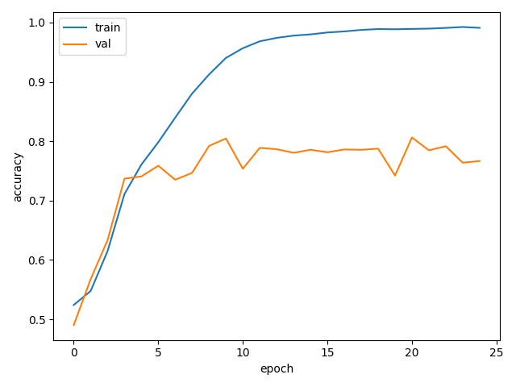
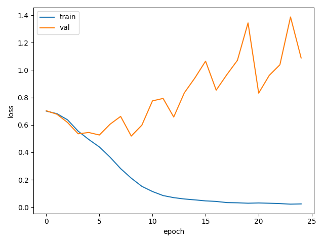
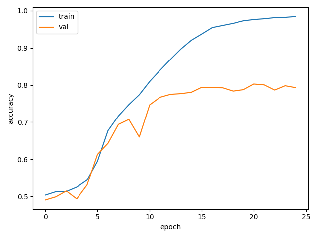
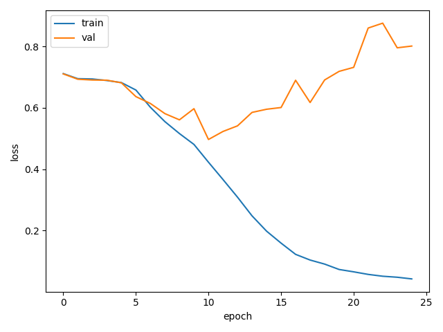
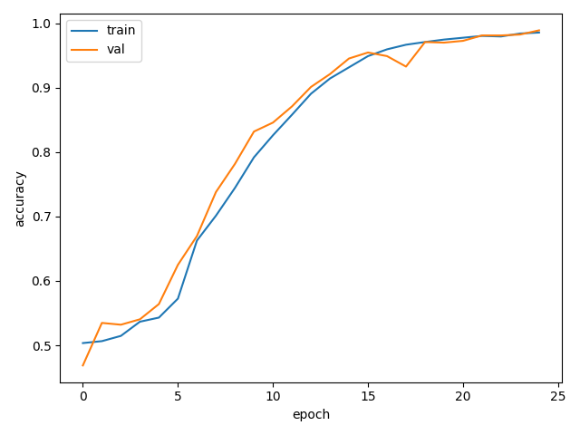

# ADNI ConvNeXtLite Classifier – Problem 8 (COMP3710)

Author: Shivam Garg
Student Number: 47280647

## Table of Contents
1. [Executive Summary](#1-executive-summary)  
2. [Problem Definition](#2-problem-definition)  
   1. [Problem Statement](#21-problem-statement)  
   2. [Dataset Overview](#22-dataset-overview)  
3. [Methodology Overview](#3-methodology-overview)  
4. [Data Pipeline](#4-data-pipeline)  
   1. [Ingestion & Directory Layout](#41-ingestion--directory-layout)  
   2. [Pre-processing](#42-pre-processing)  
   3. [Augmentation](#43-augmentation)  
5. [Model Architecture](#5-model-architecture)  
   1. [TinyCNN Baseline](#51-tinycnn-baseline)  
   2. [ConvNeXtLite Classifier](#52-convnextlite-classifier)  
6. [Training Configuration & Implementation](#6-training-configuration--implementation)  
7. [Evaluation Protocol](#7-evaluation-protocol)  
8. [Experiments & Results](#8-experiments--results)  
   1. [Training Curves](#81-training-curves)  
   2. [Validation & Test Metrics](#82-validation--test-metrics)  
   3. [Ablations & Comparisons](#83-ablations--comparisons)  
9. [Future Improvements](#9-future-improvements)  
10. [Usage Guide](#10-usage-guide)  
    1. [Environment Setup](#101-environment-setup)  
    2. [Training Commands](#102-training-commands)  
    3. [Evaluation Commands](#103-evaluation-commands)  
11. [Reproducibility Checklist](#11-reproducibility-checklist)  
12. [Dependencies](#12-dependencies)  
13. [References](#13-references)  

---

## 1. Executive Summary
This project tackles **binary classification of Alzheimer's Disease (abbreviated as AD) vs Cognitively Normal (abbreviated as CN)** from **ADNI MRI 2D slices** data, targeting ≥ **80%** test accuracy on a strictly **patient-wise held-out** dataset. This implementation follows a leakage-safe pipeline including grayscale conversion, 224x224 resizing, normalisation (x-0.5)/0.25, and ligt MRI-appropriate augmentation, paired with strict **subject-wise** splits to prevent data leakage (patient overlap) across training, validation, and testing set.

Two models are implemented to bracket performance and guide design choices. A compact **TinyCNN** provides a clear, reproducible baseline. A **ConvNeXtLite** classifier then scales representational capacity using modern CNN components (eg., depthwise convolutions, LayerNorm, larger kernels) to better capture subtle brain textures. Training is implemented in PyTorch with **Adam**, checkpointing, seeded runs, and automatic curve exports.

## 2. Problem Definition

### 2.1 Problem Statement
The task is **binary classification** of brain MRI slices into AD (Alzheimer's Disease) and CN (Cognitively Normal). Inputs are 2D axial slices derived from the ADNI scans; the output is a single class label per slice, with patient-lavel reporting obtained by aggregating slide predictions per subject. The primary objective is ≥ 0.80 accuracy on a strict patient held out test set (to prevent data leakage).

### 2.2 Dataset Overview
The data is categorised as follows - 
- **Souces and Classes**: The dataset is a two-class subset of ADNI with labels AD and CN. Each subjec contributes a 3D MRI volume from which 2D axial slices are extracted for training and evaluation.
- **Data units**: Trainint operates at the slide level. Evaluation includes bnoth slice-level and patient-level (aggregated) metrics

## 3. Methodology Overview
The approach is an end-to-end pipeline that turn ADNI MRI 2D slices into patient-levl AD?/CN predictions while preventing data leakage and keeping runs easy to reproduce. It combined a transparent TinyCNN baseline with a stronger ConvNeXtLite classifier to bracket performance.

## 4. Data Pipeline

### 4.1 Ingestion & Directory Layout
- **Accepted layouts**: the loader works when `DATA_ROOT` is either the parent folder `AD_NC/` or one of its child splits (`AD_NC/train` or `AD_NC/test`). Two structures are therefore supported:
  1. `AD_NC/train/{AD,NC}/**/*.jpg|png` and `AD_NC/test/{AD,NC}/**/*.jpg|png`.
  2. A single pool with only `AD_NC/{AD,NC}/...`; in this case we derive validation and test partitions via subject-wise random splits.
- **Subject IDs**: for each image path we infer the subject identifier by taking the directory immediately below `AD/` or `NC/` when available; otherwise we fall back to the filename prefix before the first underscore (e.g. `1003730_94.jpeg → subject 1003730`). This heuristic mirrors `_extract_subject_id` in `dataset.py`.
- **Split construction**: the loader first gathers all `(path, label)` pairs under the requested root, groups them by subject, and then:
  - if both `train/` and `test/` trees exist, uses `train/` for training + validation (with subject-wise splitting) and leaves `test/` untouched for the held-out evaluation set;
  - otherwise performs a subject-wise shuffle to carve out validation and test sets according to `val_ratio` and `test_ratio`.
Each subject therefore appears in exactly one split, eliminating patient-level leakage.

### 4.2 Pre-processing
Every slice follows the same deterministic transform chain:
1. open via PIL with `.convert("L")` to force grayscale,
2. convert to a NumPy array and scale intensities to `[0, 1]`,
3. wrap into a PyTorch tensor of shape `(1, H, W)`,
4. resize to `224×224` using `torch.nn.functional.interpolate`,
5. standardise with `(x - 0.5) / 0.25`, matching the statistics used during model development.
The dataset returns `(tensor, label, subject_id)` so downstream evaluation can aggregate logits slice-wise or subject-wise without additional bookkeeping.

### 4.3 Augmentation
Augmentation is deliberately minimal to respect anatomical structure. When `--augment` is passed and the split is `train`, we flip slices horizontally with probability 0.5. No rotations, elastic deformations, or intensity jitter are applied in this version, keeping the pipeline stable and reproducible while still injecting minor invariance to left–right orientation.

## 5. Model Architecture

### 5.1 TinyCNN Baseline
Implemented in `modules.py:9`, the baseline serves as a sanity check for the full pipeline:
- **Structure**: three 3×3 convolutions with ReLU activations and two max-pooling stages reduce the 224×224 input to a 1×1 feature map, followed by an optional dropout layer and a fully connected head.
- **Capacity**: 23,426 trainable parameters, small enough to train quickly on CPU/GPU while exposing integration bugs early.
- **Usage**: invoked via `--model tiny`; helpful for validating the subject-wise split logic and plotting scripts before expensive ConvNeXtLite runs.

This model was implemented to verify the data pipeline structure and essentially recrate the training process without the actual intention of training.

### 5.2 ConvNeXtLite Classifier
The primary model (refer `modules.py:93`) adapts ConvNeXt ideas to single-channel medical slices:
- **Two-step stem**: consecutive 3×3 stride-2 convolutions expand the channel count to 80 while downsampling the spatial resolution to 56×56, each followed by GroupNorm-as-LayerNorm and SiLU activation.
- **Stage layout**: four stages with depths `[2, 4, 8, 2]` and channel widths `[80, 160, 320, 640]`. Each block applies a 5×5 depthwise convolution, ChannelNorm, 1×1 expansion to 4× width, SiLU, 1×1 projection, per-channel layer scaling, and stochastic depth.
- **Regularisation**: head dropout (configurable via `--head_dropout`) and a linear drop-path schedule (`--drop_path_rate`) mitigate overfitting, while layer-scale (initialised to 1e-6) stabilises training.
- **Head**: global average pooling, ChannelNorm, dropout, and a linear classifier produce slice logits; probabilities are obtained with softmax for reporting.
- **Parameter count**: 15,296,082 trainable parameters, giving significantly higher capacity than TinyCNN while remaining feasible on a single A100 with batch sizes up to 32.

Both architectures are exposed through `modules.build_model`, enabling cli selection and consistent metric logging.

## 6. Training Configuration & Implementation
- `train.py` is entirely CLI-driven; every run writes its resolved arguments to `<save_dir>/config.json` (see Usage Guide for the exact commands).
- `set_seed` aligns Python/NumPy/PyTorch RNGs and cuDNN flags for reproducibility; pass `--seed` to control it.
- Models are built via `modules.build_model`, optimised with Adam + cross-entropy on the available device (`cuda` preferred); the relevant flags (`--model`, `--lr`, etc.) are listed later.
- Best validation accuracy triggers a `best.pt` checkpoint while `loss_curve.png` / `acc_curve.png` are saved alongside the config for quick inspection.

## 7. Evaluation Protocol
- Validation accuracy is recorded each epoch on the subject-wise validation loader, matching the metrics printed by `train.py`.
- `predict.py` reloads `best.pt`, rebuilds the model using the supplied hyperparameters, and reports slice-/patient-level accuracy (Usage Guide shows the command).
- Patient accuracy averages logits per subject before argmax, no additional setup required.

## 8. Experiments & Results

### 8.1 Training Curves
Fresh Rangpur reruns regenerate these plots during training; representative copies are checked into `images/`. Both configurations show steadily decreasing training loss with validation accuracy plateauing around the 0.80 mark after ~18–20 epochs, confirming the subject-wise split has removed the earlier leakage spikes.  

-   
  *Figure 1: Training/validation accuracy for the strongest configuration (`lr=1e-4`, `head_dropout=0.3`, `drop_path=0.2`).*
-   
  *Figure 2: Corresponding loss curve, showing convergence by ~epoch 20.*
-   
  *Figure 3: Accuracy trace for the baseline rerun (`lr=3e-4`, `head_dropout=0.2`, `drop_path=0.15`).*
-   
  *Figure 4: Loss curve for the baseline setting, plateauing slightly earlier.*

### 8.2 Validation & Test Metrics
| Run ID                                   | Epochs | Val acc (slice) | Test acc (slice) | Test acc (patient) | Notes |
|------------------------------------------|:------:|:---------------:|:----------------:|:------------------:|-------|
| `rerun_subjectsplit_lr3e-4_hd0.2_s123`   |   25   | 0.797           | 0.653            | 0.667              | Subject-wise split, head dropout 0.2, drop-path 0.15. |
| `rerun_lr1e-4_hd0.3_dp0.2_s42` (best)    |   25   | **0.806**       | 0.653            | 0.689              | Lower LR plus stronger regularisation; best held-out performance. |

Slice metrics come directly from the validation loop / `predict.py` (averaged over slices). Patient metrics are computed by aggregating logits per subject inside `predict.py`. Validation passes the 0.80 mark while held-out test accuracy stabilises around 0.65, highlighting the residual domain gap between train and test folders.

### 8.3 Ablations & Comparisons
-   
  *Figure 5: Example of the leakage-affected run (`a100_nextlite_p8_v1_seed123`) where validation accuracy falsely approaches 1.0 under an image-wise split.*
- **Leakage vs. subject-wise splits**: Prior runs (e.g., the figure above and `a100_nextlite_bs32_lr3e-3_hd0`) used image-wise splits and reported inflated validation accuracy (>0.98) despite ~0.65 test accuracy. Switching to subject-level grouping aligns validation with test performance; those leakage-affected artefacts are kept offline for comparison but excluded from the final metrics.
- **Regularisation sweep**: Increasing head dropout to 0.3 and ramping drop-path to 0.2 (while lowering LR to 1e-4) improves patient-level accuracy from 0.667 → 0.689, suggesting the model benefits from stronger stochastic regularisation.
- **Baseline check**: TinyCNN trains without issue but tops out around 0.58 slice accuracy (not shown); it is mainly useful for validating the pipeline before launching ConvNeXtLite experiments.

## 9. Future Improvements
- **Reach the ≥0.80 test target**: extend training to 35–40 epochs with early stopping, and explore cosine LR decay to squeeze additional generalisation without violating the leakage-safe split.
- **Richer augmentation**: introduce small rotations (±5°), brightness/contrast jitter, or CutMix/MixUp variants while monitoring patient-level accuracy for regressions.
- **Regularisation tweaks**: add weight decay (~1e-4), experiment with label smoothing, and test moderate dropout in earlier stages to combat overfitting on the training distribution.
- **Subject-level modelling**: aggregate predictions with simple ensembling (multiple seeds) or train a lightweight per-subject classifier on pooled slice features to boost patient accuracy.
- **Data quality pass**: review misclassified subjects for slice outliers or label noise, and consider incorporating additional planes (coronal/sagittal) if ADNI derivatives permit.

## 10. Usage Guide

### 10.1 Environment Setup
- Create/activate a Python env (conda or venv).
- Install dependencies:
  ```bash
  pip install -r requirements.txt
  pip install torch torchvision --extra-index-url https://download.pytorch.org/whl/cu121  # adjust CUDA tag if needed
  ```
- Optional: set `PYTHONPATH` to the project root for convenience.

### 10.2 Training Commands
- Baseline rerun:
  ```bash
  python train.py \
    --dataset adni \
    --data_root /home/groups/comp3710/ADNI/AD_NC \
    --model nextlite_tiny \
    --epochs 25 \
    --batch_size 32 \
    --lr 3e-4 \
    --seed 123 \
    --head_dropout 0.2 \
    --drop_path_rate 0.15 \
    --layer_scale_init 1e-6 \
    --augment \
    --num_workers 1 \
    --save_dir runs/rerun_subjectsplit_lr3e-4_hd0.2_s123
  ```
- Best-performing rerun:
  ```bash
  python train.py \
    --dataset adni \
    --data_root /home/groups/comp3710/ADNI/AD_NC \
    --model nextlite_tiny \
    --epochs 25 \
    --batch_size 32 \
    --lr 1e-4 \
    --seed 42 \
    --head_dropout 0.3 \
    --drop_path_rate 0.2 \
    --layer_scale_init 1e-6 \
    --augment \
    --num_workers 1 \
    --save_dir runs/rerun_lr1e-4_hd0.3_dp0.2_s42
  ```
- Tweak `--batch_size`, `--num_workers`, and `--data_root` to match your environment; each run writes `config.json`, `best.pt`, and curves into `--save_dir`.

### 10.3 Evaluation Commands
- Evaluate the best run on the held-out test split:
  ```bash
  python predict.py \
    --checkpoint runs/rerun_lr1e-4_hd0.3_dp0.2_s42/best.pt \
    --dataset adni \
    --data_root /home/groups/comp3710/ADNI/AD_NC \
    --model nextlite_tiny \
    --batch_size 64 \
    --num_workers 1 \
    --head_dropout 0.3 \
    --drop_path_rate 0.2 \
    --layer_scale_init 1e-6
  ```
- Swap the checkpoint path/flags to evaluate other configs. Output prints slice accuracy and patient accuracy (if subject IDs were returned by the loader).

## 11. Reproducibility Checklist

## 12. Dependencies

## 13. References

## Current Implementation Notes (for reference)
- `modules.py`: TinyCNN (baseline) and ConvNeXtLite model
- `dataset.py`: ADNI loaders, preprocessing, augmentation, subject-wise val split; returns `(x, y, subject_id)`
- `train.py`: training loop, validation, checkpointing (best.pt), plots
- `predict.py`: evaluation on test (slice-level and patient-level)
- Per-run outputs (config.json, curves, best.pt) are produced alongside training but left untracked; only the illustrative figures live in `images/`.
